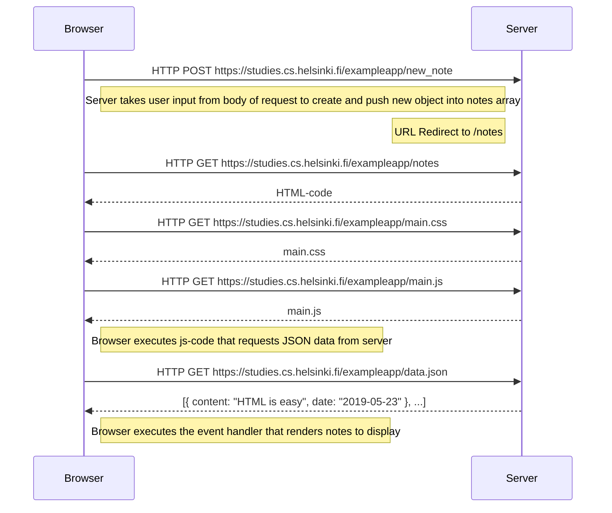

```mermaid
sequenceDiagram
Browser->>Server: HTTP POST https://studies.cs.helsinki.fi/exampleapp/new_note
Note left of Server: Server takes user input from body of request to create and push new object into notes array
Note left of Server: URL Redirect to /notes
Browser->>Server: HTTP GET https://studies.cs.helsinki.fi/exampleapp/notes
Server-->>Browser: HTML-code
Browser->>Server: HTTP GET https://studies.cs.helsinki.fi/exampleapp/main.css
Server-->>Browser: main.css
Browser->>Server: HTTP GET https://studies.cs.helsinki.fi/exampleapp/main.js
Server-->>Browser: main.js
Note right of Browser: Browser executes js-code that requests JSON data from server
Browser->>Server: HTTP GET https://studies.cs.helsinki.fi/exampleapp/data.json
Server-->>Browser: [{ content: "HTML is easy", date: "2019-05-23" }, ...]
note right of Browser: Browser executes the event handler that renders notes to display
```
