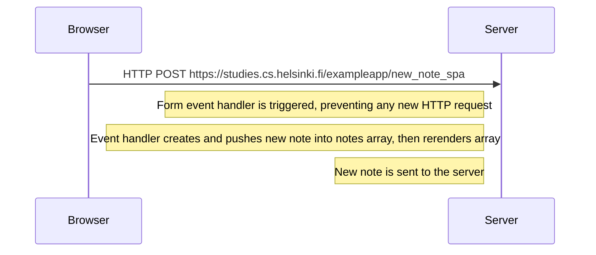

```mermaid
sequenceDiagram
Browser->>Server: HTTP POST https://studies.cs.helsinki.fi/exampleapp/new_note_spa
Note left of Server: Form event handler is triggered, preventing any new HTTP request
Note left of Server: Event handler creates and pushes new note into notes array, then rerenders array
Note left of Server: New note is sent to the server
```
